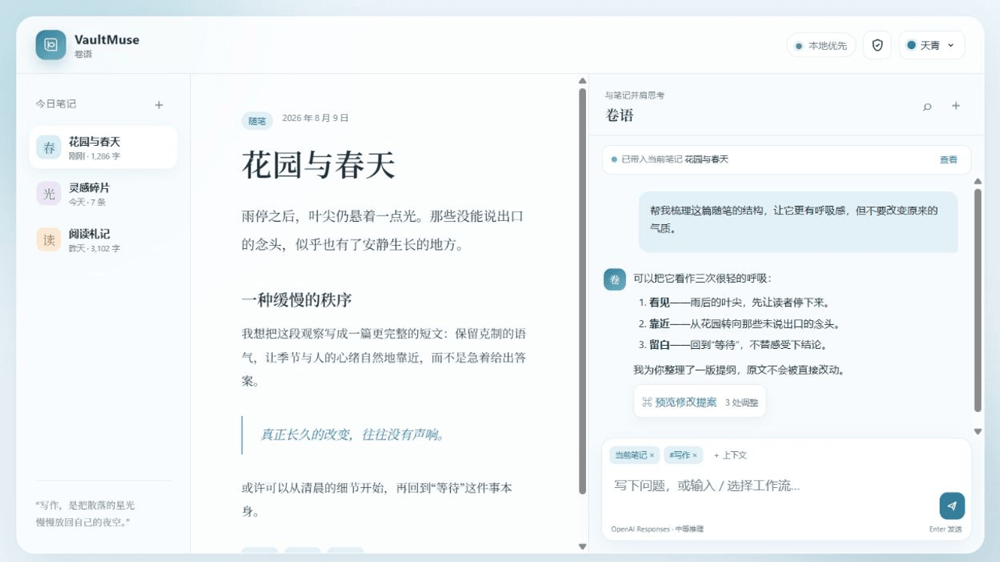

<div align="center">

# VaultMuse

**A quiet, transparent AI companion between your notes and your next thought.**

[](https://github.com/ferretgeek/VaultMuse/actions/workflows/ci.yml)
[](https://github.com/ferretgeek/VaultMuse/actions/workflows/codeql.yml)
[](./LICENSE)
[](https://obsidian.md/)

[简体中文](./README.md) · [Privacy](./docs/PRIVACY.md) · [Install & deploy](./docs/DEPLOYMENT_EN.md) · [Interactive demo](./demo/)

</div>



VaultMuse is a desktop Obsidian AI conversation plugin. It reads only the notes, tags, selections, or images you explicitly attach. An answer becomes a reviewable proposal before it can change your vault.

## At a glance

- **Visible context** — inspect and remove every item used for the current turn; no whole-vault crawl.
- **Guarded writing** — insert, append, replace, create, and multi-file diffs require confirmation and offer undo.
- **Provider freedom** — OpenAI Responses, OpenAI-compatible Chat Completions, Anthropic Messages, and local Ollama.
- **Sensitive by default** — API keys and custom headers stay memory-only unless you opt in; remote endpoints require HTTPS and unsafe headers are rejected.
- **A complete workspace** — streaming, collapsible reasoning, images, searchable/pinned/exportable history, slash workflows, and prompt-cache-aware requests.
- **Four global themes** — Sky, Jade, Sunset, and Graphite; persisted from the top-right picker, with Graphite fixed at `#17191d`.

## Install

Download `main.js`, `manifest.json`, and `styles.css` from [Releases](https://github.com/ferretgeek/VaultMuse/releases), then place them in:

```text
<your Vault>/.obsidian/plugins/vault-muse/
```

Restart Obsidian, enable **VaultMuse** under Community plugins, and add a model profile. Keep “Store sensitive settings locally” disabled unless you accept plaintext-at-rest storage. See [installation and deployment](./docs/DEPLOYMENT_EN.md).

## Security boundary

- Chat never edits files by itself; only an explicitly confirmed action writes.
- Traversal, absolute paths, `.trash`, and the vault configuration directory are blocked.
- Deletions use Obsidian's trash instead of permanent removal.
- Conversations and settings live in the current vault's plugin data and can be cleared from Advanced settings.
- VaultMuse does not proxy or conceal model traffic. Your selected provider receives the content you explicitly send.

Read [privacy and data flow](./docs/PRIVACY.md) and the [security policy](./SECURITY.md) before use.

## Development

```bash
npm ci
npm run check
npm run package:release
```

`npm run check` runs ESLint, 55 pure-logic tests, strict type checks, and a production build. Builds stay in the repository by default; files are copied to a test vault only when `VAULT_MUSE_DEPLOY_DIR` is explicitly set.

## Origin and license

VaultMuse is an independent derivative of the MIT-licensed `grok-obsidian` project. Original copyright and provenance are preserved in [NOTICE](./NOTICE.md). Released under the [MIT License](./LICENSE).
