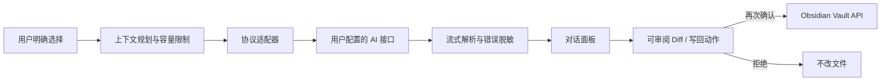

# Architecture / 架构

- `src/main.ts` coordinates plugin lifecycle, context, persistence, and confirmed actions.
- `src/chatView.ts` and modal modules own the Obsidian UI; `styles.css` provides all four themes.
- `src/providers/` contains bounded HTTP, SSE, protocol payloads, validation, and redaction.
- Pure modules handle context planning, prompt windows, diffs, undo, attachments, and history; they are covered by `tests/pure.test.mjs`.
- `demo/` is a standalone, synthetic, no-network visual tour. It is not an API proxy and does not run the plugin.

所有写入都经过 Obsidian Vault API；提案路径会先规范化并拒绝越界。生产构建只在仓库生成 `main.js`，不会猜测或写入用户目录。
